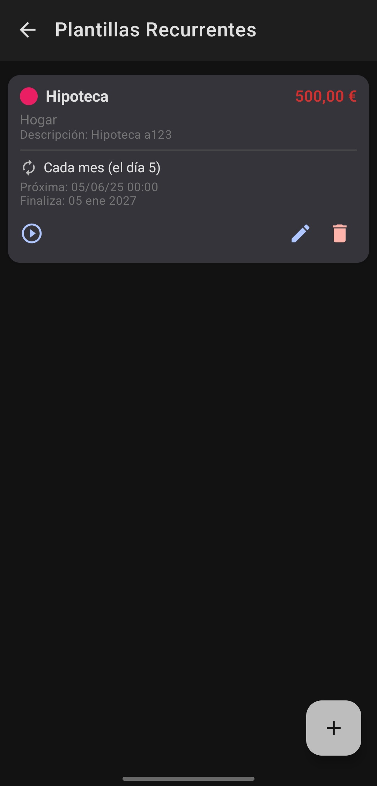

# Mi Bolsillo - Personal Finance App

<p align="center">
  
</p>

<p align="center">
  <a href="https://github.com/R4F405/mi-bolsillo-app/releases/tag/v1.4.0"></a>
  <a href="https://github.com/R4F405/mi-bolsillo-app/releases"></a>
  <a href="LICENSE"></a>
  <a href="https://deepwiki.com/R4F405/mi-bolsillo-app"></a>
</p>

## 📱 About The Project

**Mi Bolsillo** (My Pocket) is a native Android application designed for intuitive and straightforward personal finance management. Track your income and expenses, organize them into categories, and visualize your financial health with insightful charts and summaries. All your data is stored securely on your device, ensuring your privacy.

This application was built from the ground up using the latest Google-recommended technologies for Android development, with a focus on quality, maintainability, and a seamless user experience.

## 📜 Additional Documentation

For more specific details on the application's design and planning, you can consult the following documents:

* **[Ask the Codebase with AI (DeepWiki)](https://deepwiki.com/R4F405/mi-bolsillo-app)**
* **[Visual Style Guide](documentation/visual_style.md)**
* **[User Stories 1](documentation/user_stories/user_stories1.md)**
* **[User Stories 2](documentation/user_stories/user_stories2.md)**
* **[User Flows](documentation/user_flows.md)**
* **[Architecture & Structure](documentation/structure_&_architecture.md)**

## ✨ Key Features

* **Interactive Financial Dashboard**: Get an at-a-glance view of your **current balance** and **monthly income and expenses**. The dashboard features a month selector to easily navigate your financial history and a **pie chart** that dynamically breaks down your spending by category.
* **Automated Recurring Transactions**: Create templates for fixed income and expenses (like subscriptions or salaries). The app automatically logs them for you on the scheduled date.
* **Background Processing**: A `WorkManager` reliably checks for and generates recurring transactions, even when the app is closed, ensuring your finances are always up-to-date.
* **Full Transaction Management**: Easily log, modify, and delete income and expenses. The history screen allows you to search and filter all your movements.
* **Intuitive Monthly Budgets**: Take control of your spending by setting **monthly budgets for different categories**. Track your progress in real-time and mark your most important budgets as favorites for quick access from the Dashboard.
* **Customizable Categories**: Organize your finances with predefined and custom-made categories. Each one has a unique color for easy identification in lists and charts.
* **Personalized Settings**: Tailor the app to your needs by changing the **currency** and choosing your preferred **visual theme** (light, dark, or system default).
* **Private & Local Storage**: All your financial data is stored securely on your device using the Room persistence library.
* **Modern & Reactive UI**: A clean user interface built entirely with Jetpack Compose and Material Design 3, which reacts to state changes in real-time.

## 📸 Screenshots

<p align="center">
  
  
  
  
</p>

## 🛠️ How It Works

### The App's Core: MVVM and a Reactive Data Flow

The application follows an **MVVM (Model-View-ViewModel)** architecture. Here’s how data flows and the UI stays in sync:

1.  **View (Jetpack Compose)**: Screens like `DashboardScreen` observe a `StateFlow` from their corresponding `ViewModel`.
2.  **ViewModel**: The `DashboardViewModel` uses **Coroutines** and **Flow** to combine data from multiple sources (income, expenses, categories) asynchronously.
3.  **Repository**: The `ViewModel` requests data from `Repositories` (e.g., `TransactionRepository`), which act as the single source of truth.
4.  **Data Source (Room)**: The `Repository` uses a **DAO (Data Access Object)** to execute queries on the **Room** database.
5.  **Update Cycle**: When data in Room changes (e.g., a new transaction is added), the `Flow` emits the new state. This update travels through the `Repository` and `ViewModel`, and finally, Jetpack Compose automatically and efficiently recomposes the `View` to reflect the new data.

### Automation with WorkManager

Generating recurring transactions is one of the most powerful features:

-   A `RecurringTransactionWorker` is scheduled to run periodically (every 24 hours).
-   The worker queries the database for `active` recurring templates where the `next_occurrence_date` is on or before the current time.
-   For each due template, it creates a new `Transaction` in the database.
-   Finally, it uses the `RecurrenceHelper` to calculate the next occurrence date and updates the template for the next cycle.

## 🚀 Architecture & Tech Stack

Mi Bolsillo is built with a modern Android architecture, following **MVVM** and **Clean Architecture** principles.

* **Language**: [Kotlin](https://kotlinlang.org/)
* **UI**: [Jetpack Compose](https://developer.android.com/jetpack/compose) for a declarative and modern UI.
* **Architecture**:
    * [MVVM (Model-View-ViewModel)](https://developer.android.com/jetpack/guide)
    * [Clean Architecture Principles](https://blog.cleancoder.com/uncle-bob/2012/08/13/the-clean-architecture.html)
* **Asynchronous Programming**:
    * [Kotlin Coroutines & Flow](https://kotlinlang.org/docs/flow.html) for managing background threads and data streams.
* **Dependency Injection**:
    * [Hilt](https://developer.android.com/training/dependency-injection/hilt-android) for robust dependency management.
* **Persistence**:
    * [Room](https://developer.android.com/training/data-storage/room) for the local database.
    * [DataStore](https://developer.android.com/topic/libraries/architecture/datastore) for storing user preferences (theme and currency).
* **Background Processing**:
    * [WorkManager](https://developer.android.com/topic/libraries/architecture/workmanager) for handling recurring transaction generation.
* **Navigation**:
    * [Jetpack Navigation Compose](https://developer.android.com/jetpack/compose/navigation) for navigating between screens.
* **Charting**:
    * [MPAndroidChart](https://github.com/PhilJay/MPAndroidChart) for creating the expense distribution chart.
* **State Management**:
    * `StateFlow` and `collectAsStateWithLifecycle` for safe and efficient UI state management.

## 📦 Project Structure

```
app/
├─ src/main/
│  ├─ java/com/rafa/mi_bolsillo_app/
│  │  ├─ data/
│  │  │  ├─ local/
│  │  │  │  ├─ dao/        # Data Access Objects for Room
│  │  │  │  ├─ entity/     # Database entities (tables)
│  │  │  │  ├─ converters/ # Type converters for Room
│  │  │  ├─ repository/    # Repository implementations
│  │  ├─ di/               # Hilt dependency injection modules
│  │  ├─ navigation/       # Navigation configuration (AppScreens)
│  │  ├─ ui/               # UI components (Views and ViewModels)
│  │  │  ├─ dashboard/
│  │  │  ├─ transactions/
│  │  │  ├─ category_management/
│  │  │  ├─ recurring_transactions/
│  │  │  ├─ budget/
│  │  │  ├─ settings/
│  │  │  ├─ components/     # Reusable UI components
│  │  │  ├─ model/          # UI-specific data models
│  │  │  ├─ theme/          # App theme and styles
│  │  ├─ utils/              # Utility classes and helpers (e.g., RecurrenceHelper)
│  │  ├─ workers/            # WorkManager implementations
│  ├─ res/                 # Resources (images, strings, colors, etc.)
```

## ⚡ Getting Started

To get a local copy up and running, follow these simple steps.

1.  Clone the repository:
    ```sh
    git clone https://github.com/R4F405/mi-bolsillo-app.git
    ```
2.  Open the project in [Android Studio](https://developer.android.com/studio).
3.  Build and run the app on an Android device or emulator (min. API level 26).

## 🔮 Roadmap

* ☁️ **Cloud Sync**: Keep your data backed up and synced across multiple devices.
* 📤 **Data Export**: Download your transaction history as a CSV or PDF file.
* 🔔 **Smart Notifications**: Receive alerts for budget overruns and other important events.
* 🎨 **Advanced Customization**: More themes, widgets, and visual settings.

## 🤝 Contributing

Contributions are what make the open-source community such an amazing place to learn, inspire, and create. Any contributions you make are **greatly appreciated**.

Please follow these steps to contribute:
1.  Fork the Project
2.  Create your Feature Branch (`git checkout -b feature/AmazingFeature`)
3.  Commit your Changes (`git commit -m 'Add some AmazingFeature'`)
4.  Push to the Branch (`git push origin feature/AmazingFeature`)
5.  Open a Pull Request

## 📄 License

This project is licensed under the **GNU General Public License v3.0**. See the `LICENSE` file for more information.

---

<p align="center">
  Developed with ❤️ by Rafa
</p>