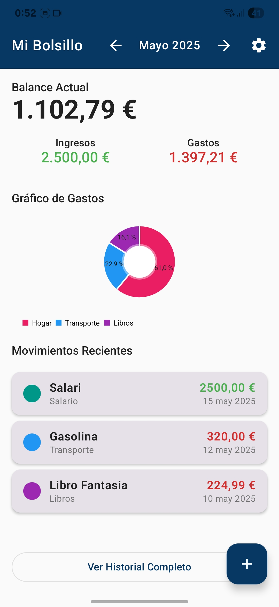
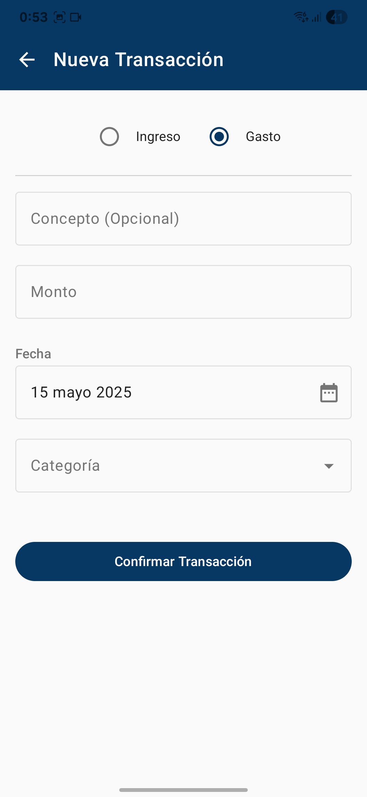
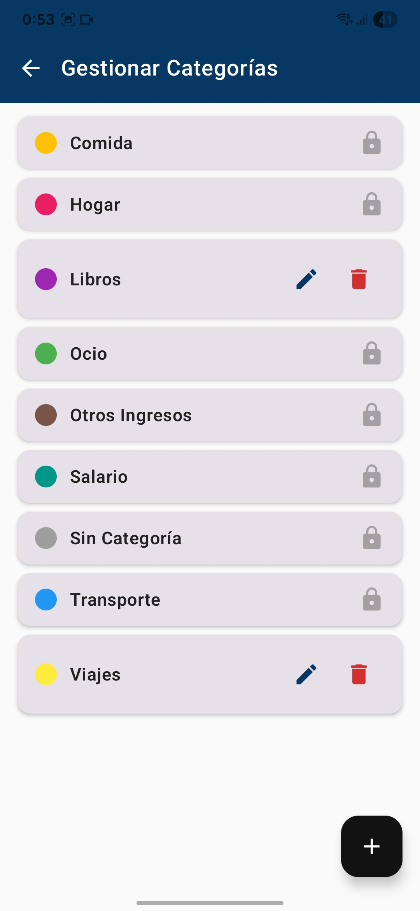

# Mi Bolsillo - Personal Finance App

<p align="center">
  
</p>

<p align="center">
  <a href="https://github.com/R4F405/mi-bolsillo-app/releases/tag/v1.3.0"></a>
  <a href="https://github.com/rafa/mi_bolsillo_app/releases"></a>
  <a href="LICENSE"></a>
</p>

## 📱 About The Project

**Mi Bolsillo** (My Pocket) is a native Android application designed for intuitive and straightforward personal finance management. Track your income and expenses, organize them into categories, and visualize your financial health with insightful charts and summaries. All your data is stored securely on your device, ensuring your privacy.

## 📜 Documentation

For more specific details on the application's design and planning, you can consult the following documents:

* **[Visual Style Guide](documentation/visual_style.md)**
* **[User Stories](documentation/user_stories.md)**
* **[User Flows](documentation/user_flows.md)**
* **[Structure and Architecture (Summary)](documentation/structure_&_architecture.md)**

## ✨ Key Features

-   **Financial Dashboard**: Get an at-a-glance view of your current balance, monthly income, and expenses, along with a pie chart visualizing spending by category.
-   **Recurring Transactions**: Create templates for recurring payments like subscriptions or salary to automate transaction logging.
-   **Automated Background Processing**: A `WorkManager` background job reliably checks for and creates recurring transactions, even when the app is not running.
-   **Quick Transaction Entry**: Log new income and expenses with a flexible and easy-to-use interface.
-   **Comprehensive History**: View a complete history of all your transactions, with options to edit or delete any entry.
-   **Intuitive Monthly Budgets**: Take control of your spending by setting monthly budgets for various expense categories. Easily visualize your budget progress in real-time, helping you stay on track and avoid overspending.
-   **Customizable Categories**: Organize your finances with customizable categories, each with a distinctive color for easy identification.
-   **Secure Local Storage**: All financial data is stored locally and securely on your device using the Room persistence library.
-   **Modern UI**: A clean and modern user interface built entirely with Jetpack Compose and Material Design 3.

## 📸 Screenshots

<p align="center">
  
  
  
  
</p>

## 🚀 Architecture & Tech Stack

Mi Bolsillo is built with a modern Android architecture, following MVVM (Model-View-ViewModel) and Clean Architecture principles.

-   **Language**: [Kotlin](https://kotlinlang.org/)
-   **UI**: [Jetpack Compose](https://developer.android.com/jetpack/compose) for building a declarative and modern UI.
-   **Architecture**:
    -   [MVVM (Model-View-ViewModel)](https://developer.android.com/jetpack/guide)
    -   [Clean Architecture Principles](https://blog.cleancoder.com/uncle-bob/2012/08/13/the-clean-architecture.html)
-   **Asynchronous Programming**:
    -   [Kotlin Coroutines & Flow](https://kotlinlang.org/docs/flow.html) for managing background threads and handling data streams.
-   **Dependency Injection**:
    -   [Hilt](https://developer.android.com/training/dependency-injection/hilt-android) for robust dependency management.
-   **Persistence**:
    -   [Room Database](https://developer.android.com/training/data-storage/room) for local data storage.
-   **Background Processing**:
    -   [WorkManager](https://developer.android.com/topic/libraries/architecture/workmanager) to handle recurring transaction generation.
-   **Navigation**:
    -   [Jetpack Navigation Compose](https://developer.android.com/jetpack/compose/navigation) for navigating between screens.
-   **Charting**:
    -   [MPAndroidChart](https://github.com/PhilJay/MPAndroidChart) for creating the expense distribution chart.
-   **State Management**:
    -   [Kotlin Flow](https://kotlinlang.org/docs/flow.html) and [StateFlow](https://kotlin.github.io/kotlinx.coroutines/kotlinx-coroutines-core/kotlinx.coroutines.flow/-state-flow/) for managing UI state.

## 📦 Project Structure

```
app/
├─ src/main/
│  ├─ java/com/rafa/mi_bolsillo_app/
│  │  ├─ data/
│  │  │  ├─ local/
│  │  │  │  ├─ dao/        # Data Access Objects for Room
│  │  │  │  ├─ entity/     # Database entities (tables)
│  │  │  │  ├─ converters/ # Type converters for Room
│  │  │  ├─ repository/    # Repository implementations
│  │  ├─ di/               # Hilt dependency injection modules
│  │  ├─ navigation/       # Navigation configuration (AppScreens)
│  │  ├─ ui/
│  │  │  ├─ dashboard/
│  │  │  ├─ transactions/
│  │  │  ├─ add_transaction/
│  │  │  ├─ category_management/
│  │  │  ├─ recurring_transactions/ # UI for recurring transaction templates
│  │  │  ├─ components/          # Reusable UI components
│  │  │  ├─ model/              # UI-specific models
│  │  │  ├─ theme/              # App theme and styling
│  │  ├─ utils/              # Utility classes and helpers
│  │  ├─ workers/            # WorkManager implementations
│  ├─ res/                 # Resources (images, strings, colors, etc.)
```

## ⚡ Getting Started

To get a local copy up and running, follow these simple steps.

1.  Clone the repository:
    ```sh
    git clone https://github.com/rafa/mi_bolsillo_app.git
    ```
2.  Open the project in [Android Studio](https://developer.android.com/studio).
3.  Build and run the app on an Android device or emulator (min. API level 26).

## 🔮 Roadmap

-   ☁️ **Cloud Sync**: Keep your data backed up and synced across multiple devices.
-   📤 **Data Export**: Download your transaction history as a CSV or PDF file.
-   🔔 **Smart Notifications**: Receive alerts for budget overruns and other important events.
-   🎨 **Advanced Customization**: More themes, widgets, and visual settings.

## 🤝 Contributing

Contributions are what make the open-source community such an amazing place to learn, inspire, and create. Any contributions you make are **greatly appreciated**.

Please follow these steps to contribute:
1.  Fork the Project
2.  Create your Feature Branch (`git checkout -b feature/AmazingFeature`)
3.  Commit your Changes (`git commit -m 'Add some AmazingFeature'`)
4.  Push to the Branch (`git push origin feature/AmazingFeature`)
5.  Open a Pull Request

## 📄 License

This project is licensed under the **GNU General Public License v3.0**. See the `LICENSE` file for more information.

---

<p align="center">
  Developed with ❤️ by Rafa
</p>
