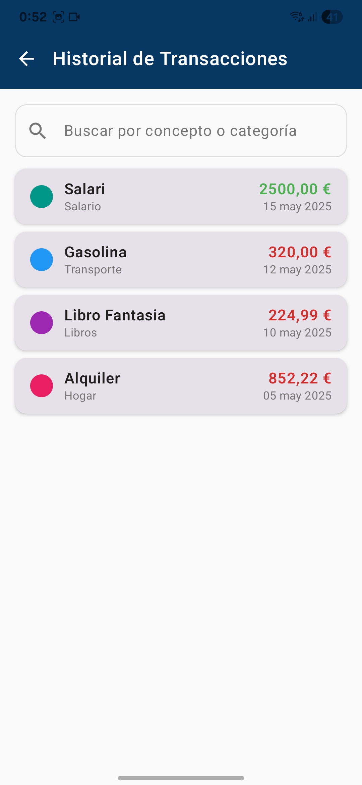

# Mi Bolsillo App

<p align="center">
  
</p>

<p align="center">
  <a href="https://github.com/rafa/mi_bolsillo_app/releases/tag/v1.0.0"></a>
  <a href="https://github.com/rafa/mi_bolsillo_app/releases"></a>
  <a href="LICENSE"></a>
</p>

## 📱 Descripción

**Mi Bolsillo App** es una aplicación móvil Android que permite a los usuarios gestionar sus finanzas personales de manera sencilla e intuitiva. Registra ingresos y gastos, organízalos por categorías y visualiza tu balance mensual con gráficos atractivos.

## ✨ Características Principales

- ✅ **Dashboard financiero** con balance actual, ingresos, gastos y gráfico de distribución por categoría
- ✅ **Registro rápido** de ingresos y gastos con categorización flexible
- ✅ **Historial completo** de transacciones con opciones de edición y eliminación
- ✅ **Categorías personalizables** con colores distintivos
- ✅ **Almacenamiento local** seguro de todos tus datos en el dispositivo
- ✅ **Interfaz moderna** desarrollada con Jetpack Compose y Material Design 3

## 📸 Capturas de Pantalla

<p align="center">
  
  
  
  
</p>

## 🚀 Arquitectura y Tecnologías

<!--
<p align="center">
  
</p>
-->

Mi Bolsillo está construida siguiendo los principios de la arquitectura MVVM (Model-View-ViewModel) y Clean Architecture:

- **Lenguaje**: [Kotlin](https://kotlinlang.org/)
- **UI**: [Jetpack Compose](https://developer.android.com/jetpack/compose)
- **Persistencia**: [Room Database](https://developer.android.com/training/data-storage/room)
- **Inyección de dependencias**: [Hilt](https://developer.android.com/training/dependency-injection/hilt-android)
- **Gráficos**: [MPAndroidChart](https://github.com/PhilJay/MPAndroidChart)
- **Gestión de estado**: [Kotlin Flow](https://kotlinlang.org/docs/flow.html) y [StateFlow](https://kotlin.github.io/kotlinx.coroutines/kotlinx-coroutines-core/kotlinx.coroutines.flow/-state-flow/)

## 📦 Estructura del Proyecto

```
app/
├─ src/main/
│  ├─ java/com/rafa/mi_bolsillo_app/
│  │  ├─ data/
│  │  │  ├─ local/
│  │  │  │  ├─ dao/        # Acceso a datos (Data Access Objects)
│  │  │  │  ├─ entity/     # Entidades de la base de datos
│  │  │  │  ├─ converters/ # Conversores para tipos de datos
│  │  │  ├─ repository/    # Implementación de repositorios
│  │  ├─ di/               # Módulos de inyección de dependencias
│  │  ├─ navigation/       # Configuración de navegación
│  │  ├─ ui/
│  │  │  ├─ add_transaction/    # Pantalla de añadir/editar transacción
│  │  │  ├─ category_management/ # Gestión de categorías
│  │  │  ├─ components/          # Componentes UI reutilizables
│  │  │  ├─ dashboard/          # Pantalla principal
│  │  │  ├─ model/              # Modelos UI
│  │  │  ├─ theme/              # Tema y estilo de la aplicación
│  │  │  ├─ transactions/       # Pantalla de historial de transacciones
│  ├─ res/                 # Recursos (imágenes, strings, colores, etc.)
```

## ⚡ Instalación

### Descarga Directa
Descarga la última versión estable desde el siguiente enlace:

👉 [Descargar Mi Bolsillo App v1.0.0](https://github.com/R4F405/mi_bolsillo_app/releases/)

### Desde el Código Fuente
1. Clona este repositorio
2. Abre el proyecto en Android Studio
3. Compila y ejecuta en un dispositivo Android o emulador

## 🔮 Funcionalidades Planeadas

- 📊 **Presupuestos mensuales por categoría**: Establece límites y realiza seguimiento de tus gastos
- ☁️ **Sincronización en la nube**: Mantén tus datos seguros y disponibles en todos tus dispositivos
- 📤 **Exportación de datos**: Descarga tus transacciones como CSV o PDF
- 🔔 **Notificaciones inteligentes**: Alertas cuando excedas presupuestos u otros eventos relevantes
- 🏦 **Integración con API bancarias**: Importación automática de transacciones desde tu banco
- 🎨 **Personalización avanzada**: Temas, widgets y ajustes visuales

## 🤝 Contribuciones

Las contribuciones son bienvenidas. Por favor, sigue estos pasos:

1. Haz fork del repositorio
2. Crea una rama para tu funcionalidad (`git checkout -b feature/amazing-feature`)
3. Haz commit de tus cambios (`git commit -m 'Add some amazing feature'`)
4. Haz push a la rama (`git push origin feature/amazing-feature`)
5. Abre un Pull Request

## 📄 Licencia

Este proyecto está licenciado bajo [GNU GPL3](LICENSE).

---

<p align="center">
  Desarrollado con ❤️ por Rafael
</p>
